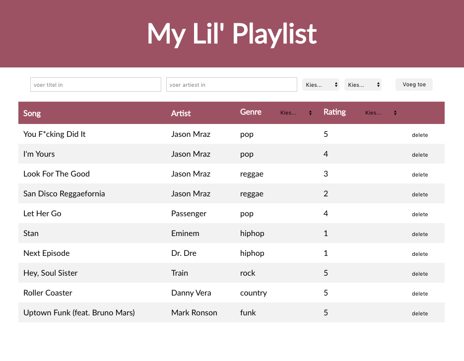

# **Project React Lil Playlist**
Winc Academy Project - Week 5: React Lil' Playlist

Bekijk de live versie van de React Lil' Playlist: https://michelleslilplaylist.netlify.app/

De opdracht was om een Single Page Application (SPA) te maken waarin je al je favoriete lievelingsliedjes kunt opslaan met rating.

## Requirements:

Om aan de eisen van de (denkbeeldige) werkgever te moeten voldoen verwachten we dat jullie SPA aan de volgende **core functionaliteiten** voldoet:

- Als gebruiker wil ik de volgende gegevens over mijn nummer willen invullen: titel, artiest, genre, rating (dropdown menu is geen vereiste).
- Als gebruiker wil ik op één button kunnen klikken waardoor mijn ingevulde nummer toegevoegd wordt aan mijn playlist.
- Als gebruiker wil ik mijn nummers kunnen zien in een overzicht (mijn playlist), waar alle ingevulde gegevens in zichtbaar zijn.

## Overige voorwaarden:

- Je bent helemaal vrij om je components zelf op te bouwen: Stateful en/of Smart versus Dumb, dan wel met Class components, dan wel Functional Components (met de UseState Hook)....
- .....Maar, let wel op dat je geen spaghetti code krijgt, waarin elk component alles doet (én State beheert, én functies beheert én UI display, etc.)

## Geslaagd = Core Functionaliteiten + 3 punten

Naast deze bovenstaande Core Functionaliteiten zijn jullie verplicht om 3 extra punten uit de onderstaande lijst te kiezen.

**Aanvullende punten:**

- **1 PUNT** – **Sorteren** van de liedjes op naam (a-z of z-a) of artiest (a-z of z-a), sorteren op sterren (5-1 of 1-5)
- **1 PUNT** – **Delete knop**: verwijderen van liedjes uit de state (super bonus punten als deze dan ook nog verwijderd worden uit de database)
- **1 PUNT** – **Categoriseren:** elk genre krijgt zijn eigen lijstje en het nummer dat je toevoegt komt terecht bij het respectievelijke genre
- **2 PUNTEN** – **Filteren** van liedjes op
    - genre (selecteren welke genres je wilt) in de UI zie je of een dropdown waarmee je 1 genre kan selecteren, of je maakt een checkbox per genre, als die checkbox is aangevinkt: toon het genre (dit kunnen er dus ook meerdere of geen één zijn)
    - sterren (sorteren welke resultaten met x sterren je wilt zien) in de UI zie je of een dropdown waarmee je 1 rating kan selecteren, of je maakt een checkbox per rating, als die checkbox is aangevinkt: toon alle liedje van die rating (dit kunnen er dus ook meerdere of geen één zijn)
- **2 PUNTEN** – **[Routing](https://reacttraining.com/react-router/web/guides/quick-start)** (/Navigatie)**:** toevoegen van een navbar of menu met een link en pagina "About us", met daarin een kort verhaaltje over jezelf en dit project (max 10 zinnen)
- **2 PUNTEN** – **REDUX**
- **3 PUNTEN** – **Firebase API:** Toevoegen van een end-point in de database om, de data op te slaan

## Design

Deze week ligt de focus 100% op React. Binnen React komt alle "logica" en functionaliteit uit het gebruik van JavaScript met praktijkvoorbeelden. CSS moet het **laatste** zijn waar je mee aan de slag gaat.

## GitHub

- Wij zouden heel graag zien dat jullie de Core Functionaliteiten werkende krijgen op de uiteindelijke Master Branch.
- Vanuit deze basis kunnen jullie elke extra punt die jullie hierboven uit de lijst kiezen bouwen vanuit (en op) een aparte feature branche (bijv. sorteren).

    - Dit heeft als voordeel dat je, indien je vastloopt op een bepaalde feature, je dit werk even stil kunt leggen om verder te gaan met een andere feature. 

    - Later kan je dan altijd nog terugkomen op een feature door te wisselen naar die branch